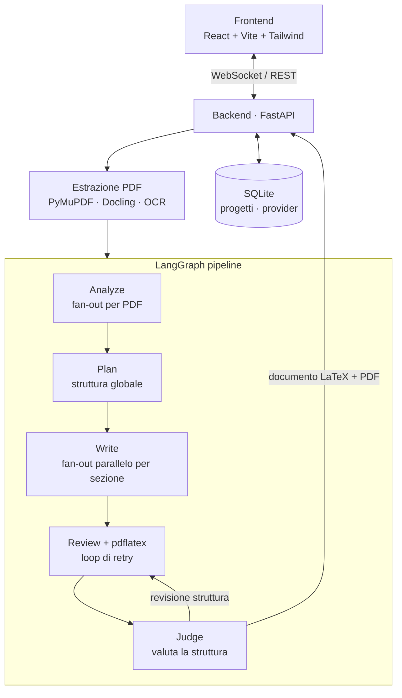

# PDF2LaTeX

Trasforma **N PDF** in un unico documento **LaTeX** organico e completo, in modo
intelligente e personalizzato, tramite una pipeline agentica (LangGraph) e una UI
React moderna, minimale e monocromatica.

Ispirato al workflow di [EPUB-Translator](https://github.com/GiuseppeBellamacina/EPUB-Translator).

## Architettura



### Agenti

| Agente   | Ruolo                                                                     |
| -------- | ------------------------------------------------------------------------- |
| Analyzer | Analizza ogni PDF (riassunto, argomenti, formule, figure) — parallelo     |
| Planner  | Unisce le analisi + il prompt utente in una struttura globale             |
| Writer   | Scrive il LaTeX di ogni sezione — parallelo                               |
| Reviewer | Corregge errori di compilazione e incoerenze (loop con pdflatex)          |
| Judge    | Valuta la struttura complessiva del PDF e richiede una revisione se serve |

I download usano il **titolo del progetto** come nome file: il PDF è
`<titolo>.pdf` e il sorgente LaTeX è un **archivio ZIP** `<titolo>.zip` con
`main.tex` e i singoli capitoli nella cartella `parts/` (più le figure).

## Avvio rapido (sviluppo)

### Backend

```pwsh
cd backend
uv sync
copy .env.example .env   # imposta PDF2TEX_ENCRYPTION_KEY
uv run python -m app.main
```

> Con hot reload usa `uv run uvicorn app.main:app --reload --reload-dir app`:
> limitando il watch alla cartella `app` si evita che le scritture in
> `storage/` (figure, log, cache Docling) provochino continui riavvii
> (`watchfiles ... changes detected`).

### Frontend

```pwsh
cd frontend
bun install
bun run dev
```

Apri `http://localhost:5173`. Configura un provider in **Provider**
(o usa quello `fake` per una prova offline), carica i PDF e genera.

## Avvio con Docker

```pwsh
docker compose up --build
```

Frontend su `http://localhost:3000`, backend su `http://localhost:8000`.
L'immagine backend include TeX Live per la compilazione `pdflatex`.

## Provider supportati

`openai`, `anthropic`, `ollama`, `custom` (OpenAI-compatibile) e `fake` (offline).
Le chiavi API sono salvate **cifrate** (Fernet) nel database locale.

## Personalizzazione

- **Prompt utente**: campo libero per indicare taglio, focus, lunghezza, ordine.
- **Estrattori**: `hybrid` (default: Docling per il testo strutturato + tabelle,
  PyMuPDF per le figure, OCR di fallback), `pymupdf` (veloce), `docling`
  (solo testo). Docling gira in **sottoprocessi isolati** su intervalli di
  poche pagine alla volta, così la memoria viene rilasciata tra un blocco e
  l'altro (niente più `std::bad_alloc` su PDF grandi); il markdown viene messo
  in cache per hash del file. OCR via `pytesseract` (lingua configurabile con
  `PDF2TEX_OCR_LANG`, default `ita+eng`).
- **Lingua**: italiano (default) o inglese.

## Affidabilità ed efficienza

- Chiamate LLM con **retry/backoff** automatico, **limite di concorrenza** e
  **cache del client**; output strutturato (Pydantic) per analyzer e planner.
- Analisi **map-reduce** dei documenti lunghi (niente troncamento silenzioso) e
  selezione del materiale per **rilevanza** nella scrittura.
- **Lint LaTeX deterministico** prima di `pdflatex` (chiude ambienti/parentesi)
  per ridurre i giri di revisione.
- **Logging** dettagliato lato server (`storage/pdf2latex.log`) e lato UI
  (eventi con livello, dettaglio e conteggio token).
