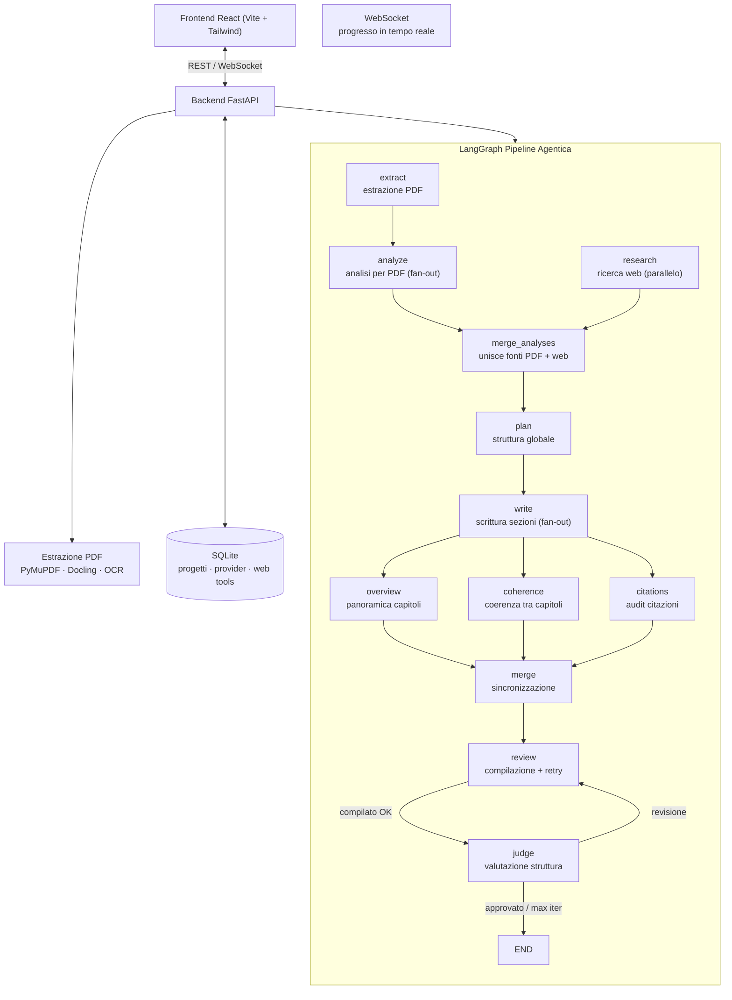
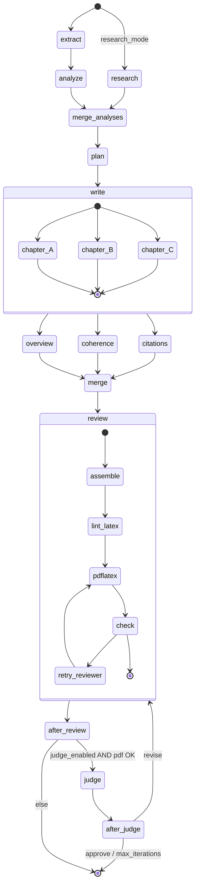

# PDF2LaTeX

Trasforma **N PDF** in un unico documento **LaTeX** organico e completo, in modo
intelligente e personalizzato, tramite una pipeline agentica (LangGraph) e una UI
React moderna, minimale e monocromatica.

Puoi anche generare documenti **senza PDF** — il sistema ricerca l'argomento sul
web e sintetizza i risultati in un documento strutturato. I due flussi (PDF + web)
possono lavorare insieme per arricchire il contenuto.

Ispirato al workflow di [EPUB-Translator](https://github.com/GiuseppeBellamacina/EPUB-Translator).

---

## Architettura

### Sistema complessivo



### Dettaglio del grafo LangGraph



---

## Il grafo agentico — come funziona

La pipeline è implementata con **LangGraph**, un framework per grafi stateful.

### Nodi del grafo

| Nodo | Ruolo | Parallelismo |
|------|-------|--------------|
| **extract** | Estrae testo, figure, riferimenti da ogni PDF (PyMuPDF/Docling/OCR) | Sequenziale (ordine configurabile) |
| **analyze** | Analizza ogni PDF (riassunto, topics, formule, references) | Fan-out per documento (`asyncio.gather`) |
| **research** | Ricerca web su un topic (STORM-style: prospettive → query → fetch → sintesi) | Parallelo con analyze |
| **merge_analyses** | Unisce le analisi da PDF e web in un unico pool per la pianificazione | Singolo (fan-in) |
| **plan** | Unisce le analisi + prompt utente in una struttura globale con capitoli e sezioni | Singolo |
| **write** | Scrive il LaTeX di ogni sezione, con contesto accumulato tra sezioni dello stesso capitolo. Inserisce figure utente nelle sezioni target | Fan-out per capitolo, sequenziale dentro ogni capitolo |
| **overview** | Genera una pagina "Panoramica" con sinossi di ogni capitolo (dopo il TOC) | Parallelo con coherence/citations |
| **coherence** | Verifica coerenza scientifica tra capitoli (contraddizioni, terminologia) | Parallelo con overview/citations |
| **citations** | Audita le citazioni: fonti utente citate? chiavi sconosciute? riferimenti mancanti? | Parallelo con overview/coherence |
| **merge** | Barriera di sincronizzazione: attende overview, coherence e citations | Singolo (fan-in) |
| **review** | Assembla il documento, applica lint LaTeX deterministico, compila con `pdflatex`, ritenta con LLM se fallisce | Singolo (loop interno di retry) |
| **judge** | Valuta la struttura del PDF compilato e richiede una revisione strutturale se necessario | Singolo (loop con review) |

### Routing condizionale

- **`_route_start`**: se ci sono documenti PDF → `analyze`, se `research_mode=True` → `research`. Entrambi possono attivarsi in parallelo
- **`_after_review`**: se `judge_enabled=False` o PDF non compilato o `judge_rounds >= judge_max_iterations` → `END`, altrimenti → `judge`
- **`_after_judge`**: se `judge_action == "revise"` → torna a `review` per ricompilare la revisione, altrimenti → `END`

### Pattern a diamante (fan-out → fan-in)

#### Diamond delle analisi (PDF + Web)
```
extract → analyze ─┐
                    ├──→ merge_analyses → plan
research (web) ─────┘
```

#### Diamond di controllo qualità
```
write ──→ overview ──→ merge
write ──→ coherence ──→ merge
write ──→ citations ──→ merge
```

### Meccanismi di sicurezza

| Meccanismo | Descrizione |
|------------|-------------|
| **Lint LaTeX deterministico** | Prima di `pdflatex`, ripara automaticamente ambienti non chiusi, parentesi sbilanciate, comandi residui (`\figref`) |
| **Retry di compilazione** | Fino a `MAX_REVIEW_RETRIES=2` tentativi con revisione LLM degli errori |
| **Rollback** | Se una revisione del judge non compila, il grafo torna alla versione precedente (`good_latex`/`good_pdf`) |
| **Best-effort** | Coherence e citations non bloccano mai la pipeline in caso di errore |
| **Espansione sezioni** | Le sezioni sotto `writer_expand_threshold` caratteri ricevono un passaggio di espansione automatico |
| **Fallback figure utente** | Figure caricate senza sezione target corrispondente → aggiunte all'inizio del documento con warning |

---

## Ricerca web (Research Mode)

Quando l'utente attiva la **Research Mode**, la pipeline può generare documenti senza PDF:

1. **Prospettive diverse**: l'LLM genera angolazioni multiple sul topic
2. **Query mirate**: ogni prospettiva produce query di ricerca specifiche
3. **Ricerca parallela**: le query vengono eseguite simultaneamente sul web
4. **Fetch pagine**: le pagine più rilevanti vengono scaricate e pulite
5. **Sintesi**: i contenuti vengono sintetizzati in `SourceAnalysis` — lo stesso formato dell'analizzatore PDF
6. **Merge**: le analisi web vengono unite a quelle PDF (se presenti) prima della pianificazione

### Web search tools configurabili

Come i provider LLM, i web tool sono configurabili da UI (**Settings → Web search tools**):

| Tool | API key | Note |
|------|---------|------|
| **Wikipedia** | ❌ gratis | API pubblica, nessuna chiave richiesta |
| **Tavily** | ✅ richiesta | Search API ottimizzata per AI |
| **Perplexity** | ✅ richiesta | Ricerca con sintesi AI |
| **Custom HTTPX** | ❌ opzionale | Template HTTPX con interpolazione JSON/URL |

Ogni tool espone `search(query)` e `fetch_page(url)`. Le chiavi API sono salvate **cifrate** (Fernet).

---

## Immagini caricate dall'utente

Oltre alle figure estratte dai PDF, l'utente può caricare immagini proprie con:

- **Didascalia personalizzata** — testo LaTeX opzionale
- **Sezione target** — titolo della sezione dove inserire l'immagine (es. "Introduction" o "Part I — Background")
- **Inclusione garantita** — le immagini utente sono sempre `mandatory`

Le immagini vengono automaticamente abbinate alle sezioni durante la scrittura.
Se il titolo della sezione non corrisponde a nessuna sezione pianificata, l'immagine
viene aggiunta all'inizio del documento con un warning.

Configurabile da **Configure → Figures → Your images**.

---

## Pipeline di estrazione

L'estrazione PDF è modellata come una sequenza di **stage indipendenti**, ognuno con tool intercambiabili:

| Stage | Tool disponibili | Default |
|-------|-----------------|---------|
| **Testo digitale** | PyMuPDF | `pymupdf` |
| **Struttura & tabelle** | Docling (IBM), Marker, MinerU | `docling` |
| **OCR scansioni** | Tesseract, RapidOCR, PaddleOCR, Surya, dots.ocr | `tesseract` |
| **Matematica** | pix2tex (LaTeX-OCR), Nougat (Meta) | `none` |
| **Figure** | PyMuPDF | `pymupdf` |
| **Punteggio figure** | Euristica, Euristica+OCR, Euristica+VLM | `heuristic` |

Configurabile da UI nella pagina **Configure** → sezione **Pipeline**. Ogni stage è opzionale (può essere disattivato), e ogni tool riporta se è installato e disponibile.

---

## Provider LLM supportati

`openai`, `anthropic`, `ollama`, `custom` (OpenAI-compatibile) e `fake` (offline).

Le chiavi API sono salvate **cifrate** (Fernet) nel database locale.

---

## Configurazione

Tutte le impostazioni sono in `backend/.env` con prefisso `PDF2TEX_`. Copia
`backend/.env.example` come punto di partenza. Qui le più utili:

| Variabile | Default | Descrizione |
|-----------|---------|-------------|
| `PDF2TEX_ENCRYPTION_KEY` | — | Chiave Fernet per cifrare le API key **(obbligatoria)** |
| `PDF2TEX_DEBUG` | `false` | Log dettagliati e hot reload |
| `PDF2TEX_LOG_LEVEL` | `INFO` | DEBUG / INFO / WARNING / ERROR |
| `PDF2TEX_PDFLATEX_BIN` | `pdflatex` | Percorso dell'eseguibile pdflatex |
| `PDF2TEX_LATEX_TEMPLATE` | `default` | Template documento: `default` / `paper` / `thesis-oneside` / `thesis-twoside` |
| `PDF2TEX_LATEX_LINT` | `true` | Lint LaTeX deterministico pre-compilazione |
| `PDF2TEX_EXTRACTOR_BACKEND` | `hybrid` | Backend estrazione: `hybrid` / `pymupdf` / `docling` |
| `PDF2TEX_OCR_LANG` | `ita+eng` | Lingue Tesseract (`+` per combinare) |
| `PDF2TEX_TESSERACT_CMD` | — | Percorso esplicito a `tesseract.exe` |
| `PDF2TEX_DOCLING_MAX_PAGES` | `200` | Salta Docling oltre questo numero di pagine |
| `PDF2TEX_LLM_MAX_CONCURRENCY` | `4` | Max chiamate LLM simultanee |
| `PDF2TEX_LLM_MAX_RETRIES` | `4` | Retry su errori transienti (429/5xx/timeout) |
| `PDF2TEX_LLM_REQUEST_TIMEOUT` | `180` | Timeout in secondi per chiamata LLM |
| `PDF2TEX_WRITER_EXPAND_THRESHOLD` | `600` | Soglia caratteri per espansione sezioni sottili |
| `PDF2TEX_WRITER_USE_KNOWLEDGE` | `false` | Il writer integra con conoscenza interna LLM |
| `PDF2TEX_COHERENCE_ENABLED` | `true` | Controllo coerenza tra capitoli |
| `PDF2TEX_CITATIONS_ENABLED` | `true` | Audit citazioni |
| `PDF2TEX_OVERVIEW_ENABLED` | `true` | Pagina panoramica capitoli |
| `PDF2TEX_JUDGE_ENABLED` | `true` | Judge strutturale post-compilazione |
| `PDF2TEX_JUDGE_MAX_ITERATIONS` | `1` | Massimi round di revisione strutturale |
| `PDF2TEX_JUDGE_VISION` | `false` | Judge visivo (richiede modello multimodale) |
| `PDF2TEX_JUDGE_VISION_MAX_PAGES` | `12` | Max pagine inviate al judge visivo |
| `PDF2TEX_MAX_FIGURES_PER_SECTION` | `4` | Cap massimo di figure per sezione |
| `PDF2TEX_FIGURE_WIDTH_RATIO` | `0.62` | Larghezza `\includegraphics` come frazione di `\linewidth` |
| `PDF2TEX_RESEARCH_MAX_QUERIES` | `5` | Max query di ricerca web per topic |
| `PDF2TEX_RESEARCH_FETCH_PAGES` | `true` | Scarica il contenuto completo delle pagine (non solo snippet) |
| `PDF2TEX_RESEARCH_PAGE_MAX_CHARS` | `8000` | Caratteri massimi per pagina fetchata |
| `PDF2TEX_RESEARCH_MAX_FETCH_CONCURRENCY` | `4` | Max download simultanei di pagine |

> **Tutte le variabili (53)** sono elencate e commentate in [`backend/.env.example`](backend/.env.example).

---

## Test

### Struttura

```
backend/tests/
├── conftest.py              # Fixture condivise (fake provider, real-llm opt-in)
├── test_bibliography.py     # make_key, consolidate, build_bib, cited_keys
├── test_citation_auditor.py # audit_citations con mock LLM
├── test_coherence.py        # check_coherence tra capitoli
├── test_diamond_merge.py    # Merge node + fan-in sincronizzazione
├── test_full_graph_e2e.py   # ⭐ Test end-to-end del grafo completo
├── test_pipeline.py         # Registry stage/tool, default config
├── test_prompts.py          # Template prompt e validazione
├── test_text_cleaning.py    # Pulizia testo, dedup headers/footers
└── test_writer_context.py   # Contesto accumulato tra sezioni
```

### Test E2E del grafo (9 test, tutti mocked)

| Test | Scenario |
|------|----------|
| `test_full_graph_diamond_completes` | Grafo completo, tutti i nodi, judge approva |
| `test_full_graph_compile_failure_then_judge_approves` | Compilazione fallisce → retry → successo |
| `test_full_graph_single_source_no_overview` | Singolo documento → overview non attivata |
| `test_full_graph_user_sources_merged_and_audited` | Fonti utente → merge pool → audit citazioni |
| `test_full_graph_judge_disapproves_then_approves_on_revision` | Judge disapprova → revisione → riapprova |
| `test_full_graph_judge_max_iterations_exhausted` | Judge disapprova 2× → limite iterazioni → END |
| `test_full_graph_judge_revision_fails_rollback_to_good` | Revisione non compila → rollback |
| `test_full_graph_coherence_and_citations_disabled` | Coherence + citations off → nodi restituiscono `{}` |
| `test_full_graph_judge_disabled_terminates_after_review` | Judge off → termina dopo review |

### Come eseguire i test

```bash
# Tutti i test (mocked, nessuna chiamata LLM)
cd backend
uv run pytest tests/ -v

# Solo i test E2E del grafo
uv run pytest tests/test_full_graph_e2e.py -v

# Test E2E con LLM reale (opzionale)
PDF2TEX_TEST_PROVIDER=openai PDF2TEX_TEST_MODEL=gpt-4o-mini \
  uv run pytest tests/test_full_graph_e2e.py::test_full_graph_with_real_llm \
  --real-llm -v

# Con coverage
uv run pytest tests/ --cov=app --cov-report=term-missing
```

### Lint & Formattazione

```bash
cd backend
uv run ruff check .          # Lint
uv run ruff format --check . # Verifica formattazione
uv run ruff format .         # Auto-formatta
```

---

## Avvio rapido (sviluppo)

### Backend

```pwsh
cd backend
uv sync
copy .env.example .env   # imposta PDF2TEX_ENCRYPTION_KEY
uv run python -m app.main
```

> Con hot reload: `uv run uvicorn app.main:app --reload --reload-dir app`

### Frontend

```pwsh
cd frontend
bun install
bun run dev
```

Apri `http://localhost:5173`. Configura un provider in **Provider**
(o usa quello `fake` per una prova offline), carica i PDF e genera.

Per usare la **Research Mode**: attiva il toggle in Upload, configura un web tool
in Settings (es. Wikipedia, gratis), inserisci un prompt e genera senza PDF.

### Docker

```pwsh
docker compose up --build
```

Frontend su `http://localhost:3000`, backend su `http://localhost:8000`.
L'immagine backend include TeX Live per la compilazione `pdflatex`.

---

## Personalizzazione

- **Prompt utente**: campo libero per indicare taglio, focus, lunghezza, ordine
- **Research Mode**: genera documenti senza PDF ricercando sul web
- **Estrattori**: pipeline componibile (vedi sezione "Pipeline di estrazione")
- **Immagini utente**: carica immagini extra con didascalia e sezione target
- **Fonti bibliografiche**: aggiungi riferimenti manuali che il documento DEVE citare
- **Lingua**: italiano (default) o inglese
- **Few-shot**: fornisci un esempio di stile LaTeX da imitare
- **Lint LaTeX**: riparazione deterministica pre-compilazione (disattivabile)
- **Judge**: ispezione strutturale del PDF con revisione automatica (disattivabile)
- **Web tools**: Tavily, Perplexity, Wikipedia, o custom HTTPX per la ricerca web
