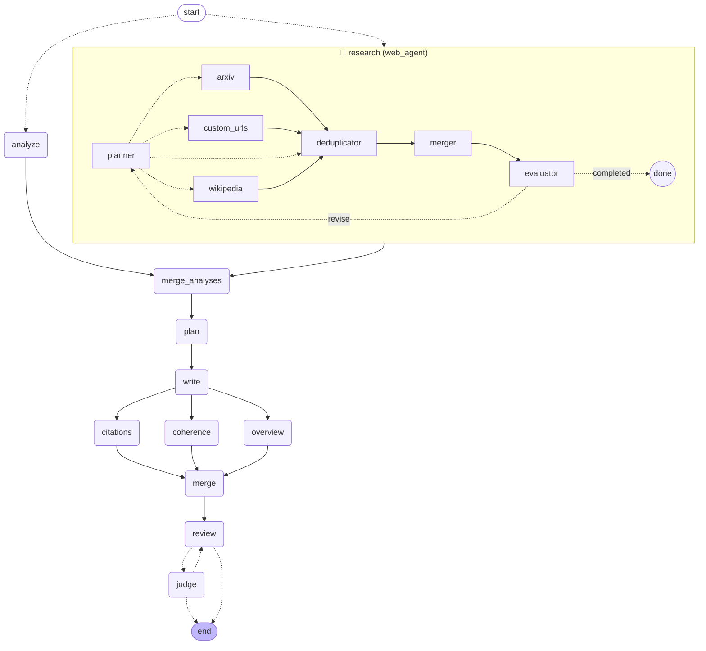

# PDF2LaTeX — Pipeline LangGraph

Il diagramma combina il flusso principale con il subgraph di **research (web_agent)** estratto programmaticamente da `get_graph(xray=True)`.

```mermaid
---
config:
  flowchart:
    curve: basis
---
graph TD;

	classDef default fill:#f2f0ff,line-height:1.2
	classDef first fill-opacity:0
	classDef last fill:#bfb6fc

	analyze("analyze")
	merge_analyses("merge_analyses")
	plan("plan")
	write("write")
	overview("overview")
	coherence("coherence")
	citations("citations")
	merge("merge")
	review("review")
	judge("judge")

	subgraph research["📡 research (web_agent)"]
		planner["planner"]
		deduplicator["deduplicator"]
		merger["merger"]
		evaluator["evaluator"]
		wikipedia["wikipedia"]
		arxiv["arxiv"]
		custom_urls["custom_urls"]
		evaluator -.-> |completed| _done_((done))
	end

	__start__(["start"]):::first
	__end__(["end"]):::last

	__start__ -.-> analyze
	__start__ -.-> research
	analyze --> merge_analyses
	citations --> merge
	coherence --> merge
	judge -.-> __end__
	judge -.-> review
	merge --> review
	merge_analyses --> plan
	overview --> merge
	plan --> write
	research --> merge_analyses
	review -.-> __end__
	review -.-> judge
	write --> citations
	write --> coherence
	write --> overview

	arxiv --> deduplicator
	custom_urls --> deduplicator
	deduplicator --> merger
	evaluator -.-> |revise| planner
	merger --> evaluator
	planner -.-> arxiv
	planner -.-> custom_urls
	planner -.-> deduplicator
	planner -.-> wikipedia
	wikipedia --> deduplicator
```
