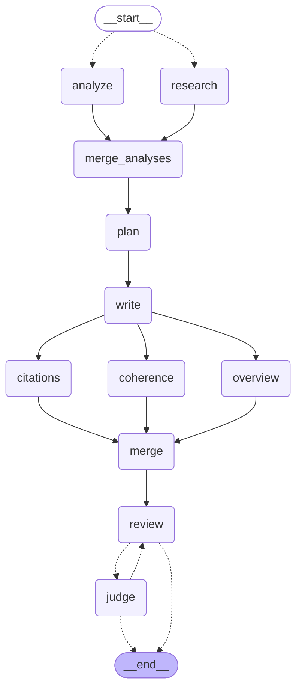

# PDF2LaTeX — Pipeline LangGraph

Diagramma generato automaticamente con `get_graph(xray=True).draw_mermaid()`.

```mermaid
---
config:
  flowchart:
    curve: basis
---
graph TD;
	__start__([<p>__start__</p>]):::first
	analyze(analyze)
	research(research)
	merge_analyses(merge_analyses)
	plan(plan)
	write(write)
	overview(overview)
	coherence(coherence)
	citations(citations)
	merge(merge)
	review(review)
	judge(judge)
	__end__([<p>__end__</p>]):::last
	__start__ -.-> analyze;
	__start__ -.-> research;
	analyze --> merge_analyses;
	citations --> merge;
	coherence --> merge;
	judge -.-> __end__;
	judge -.-> review;
	merge --> review;
	merge_analyses --> plan;
	overview --> merge;
	plan --> write;
	research --> merge_analyses;
	review -.-> __end__;
	review -.-> judge;
	write --> citations;
	write --> coherence;
	write --> overview;
	classDef default fill:#f2f0ff,line-height:1.2
	classDef first fill-opacity:0
	classDef last fill:#bfb6fc

```
